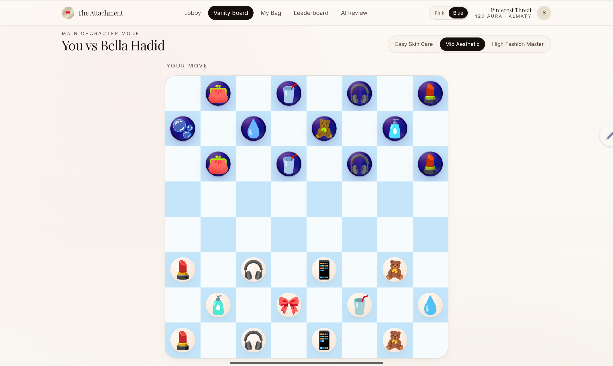
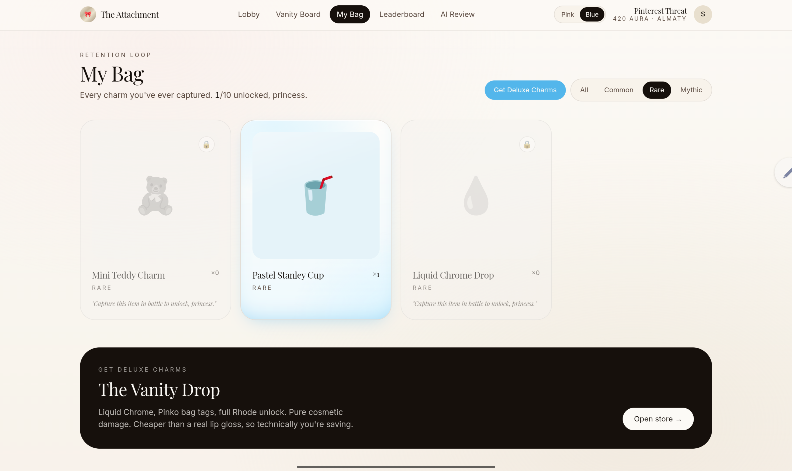
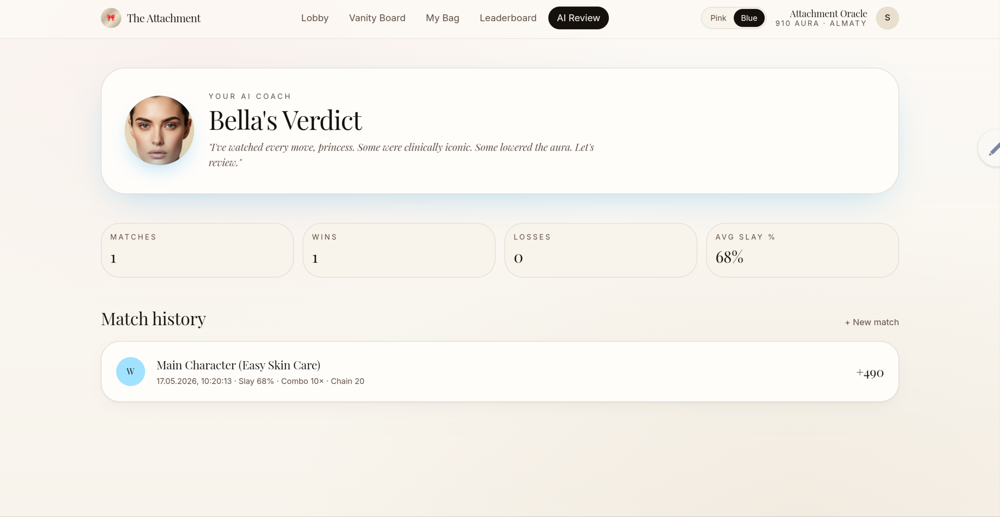

# 👛 THE ATTACHMENT

> "Not a board game. A personality disorder." 💅
> Finally, a strategy game for girls who over-accessorize. Welcome to your new digital safe place.

---

## ℹ️ Overview

**THE ATTACHMENT** is a hyper-feminine, luxury-tech web implementation of classic checkers, completely re-imagined for Gen Z, TikTok subcultures, and the coquette/high-fashion community. 

Traditional strategy games often feel cold, competitive, and visually uninspiring. **THE ATTACHMENT** changes the narrative by creating an inclusive, empowering, and ultra-aesthetic **safe place** for girls in the web-gaming ecosystem. We turned weaponized accessorizing into a tactical masterpiece.

Instead of moving lifeless wooden discs, players control **Base Charms** — high-fidelity digital miniatures of daily essentials (lip glosses, centella serums, AirPods cases, and pastel cups). This is where strategic thinking meets pure *girlhood culture*.

---

## 🌟 Highlights

* 🎀 **A Safe Place for Girls:** A gaming platform designed with restraint, luxury aesthetics, and absolute respect for the community's interests. No toxicity — just tactical femininity.
* 🔗 **The Chain Link Mechanics:** Captured pieces don't disappear; they merge visually on a dynamic metallic chain, turning the board into a visual masterpiece by the end game.
* 📱 **The It-Phone Upgrade:** Reaching the far row triggers an upgrade into a fully accessorized 3D luxury smartphone leaving a glittering pearl trail.
* 💅 **AI Coach Bella Hadid:** Post-game analytics handled by an automated AI coach delivering iconic fashion-coded feedback on your tactical mistakes and wins.
* 💸 **Girl Math Monetization & Live Inventory:** A native storefront dashboard tailored around relatable logic, backed by a persistent "My Bag" collectible storage system.

---

## 📸 Interface Preview

### 1. Main Game Board (Vanity Board)

> **Product Feature Validation:** Demonstrates the active board state in "Clean Girl Blue" mode. Notice the definitive visual split: the user's aesthetic coquette charms (bottom) vs. the AI competitor's high-gloss, neon-shadowed cyber pieces (top) to optimize tactical readability during intense gameplay.

### 2. The "My Bag" Inventory & Storefront Loop

> **Product Feature Validation:** Highlights the player progression and retention ecosystem. Shows the online-catalog style grid for locked and unlocked rewards (e.g., *Pastel Stanley Cup*), integrated directly with "The Vanity Drop" monetization drawer at the bottom.

### 3. AI Review Dashboard (Bella's Verdict)

> **Product Feature Validation:** The dedicated AI-Coach tactical hub. Features the high-fashion profile integration of Bella Hadid alongside live user performance counters (Matches, Wins, Avg Slay %) and persistent match history logs powered by database state synchronization.

---

## 💎 Core Gameplay & Rules

### 1. The Board — "The Mesh Grid"
The battlefield looks like an expensive perforated phone case or a mesh vanity pouch. The squares act as metallic eyelets/grommets where charms click into place. Players can switch seamlessly between two visual themes:
* **Coquette Pink Mode:** Velvet pastel pink and milky white aesthetics.
* **Clean Girl Blue Mode:** Minimalist powder blue and fresh cloud white.

### 2. The Pieces — "Base Charms"
Your army consists of custom accessories on white glossy bases, while your competitor's moves are controlled by high-gloss, deep Y2K chrome cyber-pieces to maximize visual clarity during intense matches.

### 3. The Chain Link Mechanics
When your charm captures an opponent's piece, it is structurally **added to your emotional baggage**. The pieces link together on a silver chain right on the board, emitting an ASMR metal clink sound.

### 4. King Row Transformation
When your chain navigates to the end of the grid, **IT-GIRL MODE IS ACTIVATED**. The unit transforms into **The It-Phone**, gaining multi-directional strategic movement power.

---

## 🚀 Game Modes

* ☕ **Soft Launch:** Play with a friend in real-time via a quick, minimalist shareable link (Powered by WebSockets/Supabase Realtime).
* 📊 **Hard Launch:** Ranked competitive matchmaking based on your regional leaderboard (Compete to be the Top Player in Almaty, Astana, or Shymkent).
* 💄 **Main Character Mode:** Face off directly against AI Coach Bella Hadid across distinct difficulties: *Easy Skincare*, *Mid Aesthetic*, and *High Fashion Master*.
* 📈 **Girl Math Ranked:** A lightning-fast, high-stakes 3-minute blitz mode where mistakes are costly but the combo payouts are massive.

---

## 👑 Tech Stack & Development Process

This platform represents a highly advanced prototype built using cutting-edge **vibe coding** pipelines:
* **Core Platform Architecture:** Rapidly engineered and beautifully compiled using **Lovable.dev**.
* **Frontend:** React, Next.js / Vite, Tailwind CSS, Framer Motion (for liquid-smooth transitions, floating micro-interactions, and chaining physics).
* **Backend/Database:** Supabase integration ready for real-time multiplayer lobbies, structured user state synchronization, and regional leaderboards segmented by Kazakhstani urban hubs.
* **Progression Logic:** Fully custom **"Aura Score"** system replacing boring Elo metrics with ranks moving from *Soft Launch Intern* up to *Weaponized Girlhood*.

---

## 👛 The Vanity Drop (Monetization)

The platform features a fully-baked, production-ready store preview showcasing how a modern strategy startup scales via authentic brand integration:
* `Liquid Chrome Skin Pack` — $4.99 (*Girl math: Basically free if you use your dad's card.*)
* `Pinko Bag Tag & Silk Ribbons Set` — $2.99 (*An absolute long-term investment into your digital aura.*)
* `Diva Mode Unlock (All Mythic Rhode Charms)` — $9.99 (*Cheaper than buying a real lip gloss, so you actually saved money.*)

---

## ✍️ Author & Vision

* **Author:** Yerlan Safia  
* **Concept:** Social Impact Project for Inclusive Gaming Spaces
* **AI Core Infrastructure:** Lovable.dev

Created with love to give girls a beautiful, highly tactical environment where their design language and daily aesthetics are treated as peak strategy assets. 

*Every move adds to the aesthetic. Slay your matches, expand your chain.*

